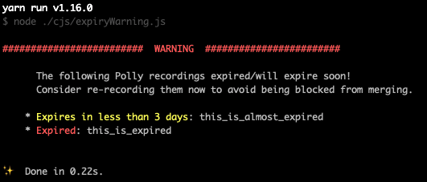

# polly-jest-presets

[](https://github.com/spotify/polly-jest-presets/actions)
[](https://www.npmjs.com/package/@spotify/polly-jest-presets)

An opinionated configuration and wrapper around [Polly] and [setup-polly-jest] to have automatic recording and playback of network requests made during your [Jest] tests.

**Note:** Polly Jest Presets bundles in all necessary Polly packages to make the setup as easy as possible for a typical Node-based web app. It uses File persister to store recordings locally. Therefore, there's no need to install Polly or Polly Jest bindings separately in your project after including this preset.

**Packages included:**

```json
"@pollyjs/adapter-node-http": "^2.6.0",
"@pollyjs/core": "^2.6.0",
"@pollyjs/persister-fs": "^2.6.0",
"setup-polly-jest": "^0.5.2",
```

## Usage

Install the preset as a dev dependency:

```sh
yarn add @spotify/polly-jest-presets -D
```

Add the preset to your [Jest config](https://jestjs.io/docs/en/configuration) (by default `jest.config.js`), in the `setupFilesAfterEnv`:

```json
{
  "setupFilesAfterEnv": ["@spotify/polly-jest-presets"]
}
```

### Getting Started

To test it out, make a network request in one of your tests.

```js
// `yarn add -D node-fetch` for this demo
const fetch = require('node-fetch');

describe('a dummy test', () => {
  it('fetches something', async () => {
    const resp = await fetch('https://reqres.in/api/users?page=2');
    const payload = await resp.json();
    expect(payload.data.length).toBeGreaterThan(1);
  });
});
```

First, you need to run the tests with the `POLLY_MODE` environment variable set to `record`. This will tell Polly that you intend for all of the requests to record in this test run. 

```sh
POLLY_MODE="record" jest
```

You should now see a `.polly_recordings` directory at the root of your project. It should contain a `.har` file which shows the request we made within the it block.

To test that playback works, disconnect your internet on your machine and run:

```sh
POLLY_MODE="replay" jest
```

The test still passes! *Note: the default POLLY_MODE is `replay`.*

### Configuration and API usage

If you want to override Polly configuration, you can add configuration to `globals.pollyConfig` in the Jest config:

```json
{
  "globals": {
    "pollyConfig": {
      "expiresIn": "3 months"
    }
  }
}
```

*See all of the valid Polly options [in the Polly documentation](https://netflix.github.io/pollyjs/#/configuration).*

You may also want to get at the global Polly instance. You can grab it from the `global` object in Node:

```js
global.pollyContext.polly.server.get('/series')
  .intercept((req, res) => res.sendStatus(200));
```

*See all of the Polly API methods [in the Polly documentation](https://netflix.github.io/pollyjs/#/api).*

## Opinions

This preset has a few opinions baked in. All of these are overridable by setting the `globals.pollyConfig` in your Jest config.

### Expire recordings often

We think it's safer to expire recordings frequently. The default `expiresIn` is set to `"14d"` in this preset, and [we plan to update Polly](https://github.com/Netflix/pollyjs/issues/226) to support throwing errors when encountering expired recordings in `replay` mode.

#### Enabling warning for recordings expiring soon

We offer a script that can be included in pre-commit hook to warn users about recordings that will expire soon. This is to encourage timely re-recording and prevent people from getting blocked because of tests failing on CI due to expired recordings.

As this script does not have access to Polly config, default values are provided and can be overridden via following environment variables:

```sh
# after how many days from last recording are recordings considered expired
POLLY_DAYS_EXPIRY=14

# how many days prior to recording expiry we should warn user about it
POLLY_DAYS_TO_WARN=3

# directory with recordings
RECORDINGS_DIR=.polly_recordings
```

Example package.json extract, using yarn and [husky](https://www.npmjs.com/package/husky):

```sh
"husky": {
    "hooks": {
      "pre-commit": "POLLY_DAYS_EXPIRY=21 node ./node_modules/@spotify/polly-jest-presets/cjs/expiryWarning.js",
    }
}
```

This will yield following output in console:



### Explicit recording only (no `recordIf*`)

We think it makes more sense to avoid recording in the background for test authoring to avoid unexpected changes to checked in .har files. Because of this, we have set all of the `recordIf*` config values to false. **This means that your tests will fail when you first write them if you don't override `POLLY_MODE`.**

## Contributing

See [CONTRIBUTING](./CONTRIBUTING.md) guidelines.

[Polly]: https://netflix.github.io/pollyjs
[setup-polly-jest]: https://www.npmjs.com/package/setup-polly-jest
[ESLint]: https://eslint.org/
[Jest]: http://jestjs.io/
